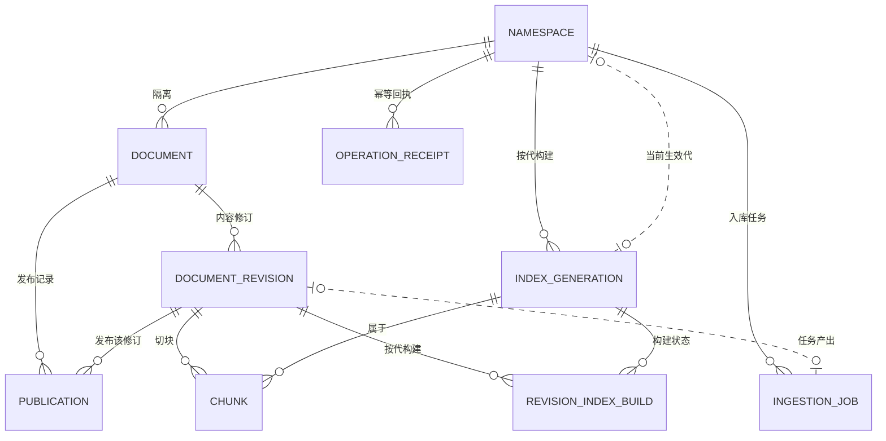
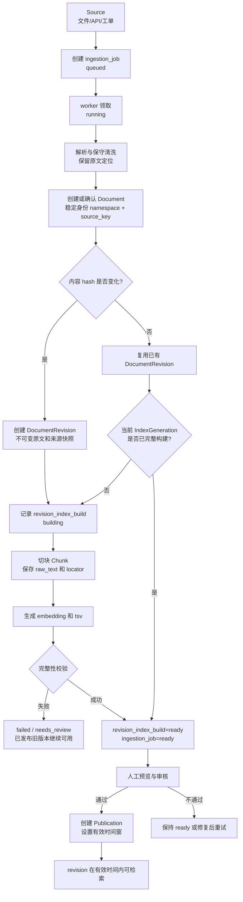
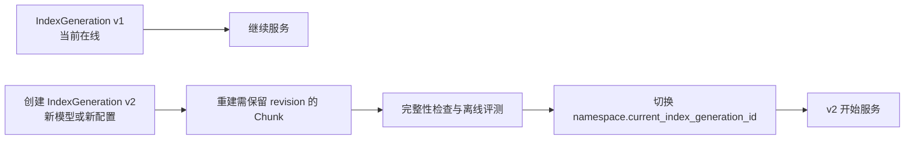

# KnowOne 架构

状态：商用首版的设计基线，尚未实现或压测。术语见 [CONTEXT.md](../CONTEXT.md)，行为以 [contracts.md](contracts.md) 为准。

## 运行形态与职责

```text
业务系统
├─ 在线请求 → KnowOne.retrieve → PostgreSQL / 共享模型端点
├─ 运营入口 → ingest / get_ingestion / publish / withdraw
└─ 后台 worker → KnowOne 入库逻辑 → 原文存储 / PostgreSQL / 模型端点
```

| 承担者 | 职责 |
|---|---|
| 调用方 | 身份认证、可信 AccessScope、业务适用条件、多轮问题补全、生成与拒答、运营界面 |
| KnowOne | 执行权限与时效约束、构建及发布知识、检索证据、报告失败和降级 |
| 运行环境 | worker 调度、共享推理资源、数据库和原文备份、告警与密钥管理 |

库形态不要求所有工作在同一个进程完成。在线检索与入库 worker 分开限制连接数和模型并发，避免批量导入挤占在线资源。无需为库自身先部署 HTTP 服务。

生成和意图路由维持在调用方。后台任务状态、发布与撤回是必要管理接口，不用“三个方法”限制真实业务需求。

## 核心数据关系

概念名见 [CONTEXT.md](../CONTEXT.md)；表名、字段名按首版 PostgreSQL 实现给出（[ADR-0004](adr/0004-postgres-pgvector.md)）。

| 概念 | 存储表 |
|---|---|
| Namespace | `namespace` |
| Document | `document` |
| DocumentRevision | `document_revision` |
| Publication | `publication` |
| Chunk | `chunk` |
| IndexGeneration | `index_generation` |
| RevisionIndexBuild | `revision_index_build` |
| IngestionJob | `ingestion_job` |
| OperationReceipt | `operation_receipt` |
| AuditEvent | `audit_event` |

### 实体关系图



说明：`AUDIT_EVENT` 通过字符串字段（object_type + object_id）记录操作对象，不与业务表建立外键；`INGESTION_JOB.source_key` 同理，首次入库时目标 `document` 尚不存在，也只存字符串关联。

### 数据生命周期与变更流程

#### 新文档：从清洗到发布

一次入库将构建和发布分开。`ready` 只表示内容已经构建并通过完整性校验，不能直接被业务检索；只有创建 `Publication` 后才在对应生效时间窗内可见。



各表在首次入库中的变化如下：

| 阶段 | 数据变化 |
|---|---|
| 提交入库 | `operation_receipt` 记录 `ingest` 请求的幂等键和请求指纹；`ingestion_job` 新增一条记录，状态为 `queued`，保存来源标识 |
| 确认身份 | 若 `(namespace, source_key)` 不存在，`document` 新增一条；它是稳定身份，不保存正文 |
| 生成内容版本 | 内容变化时 `document_revision` 新增一条，保存 `content_hash`、不可变 `content_ref` 和 `source_snapshot`；内容未变时复用同 Document 的已有 revision |
| 构建检索数据 | `revision_index_build` 创建为 `building`；`chunk` 新增多条，关联 revision 和 IndexGeneration，写入文本、定位、向量和全文检索字段 |
| 构建完成 | `revision_index_build` 标记为 `ready`；`ingestion_job.status` 变为 `ready`，`result_revision_id` 指向新建或复用的 revision |
| 正式发布 | `operation_receipt` 记录 `publish` 结果；`publication` 新增一条，指定 `revision_id` 和 `[valid_from, valid_until)`；同时递增 `document.state_generation` 并写入审计 |

失败只影响正在构建的 revision 或索引构建，不应让已发布 revision 失效。草稿 chunk 在对应 `revision_index_build` 变为 `ready` 前不可检索。

#### 已有文档：内容更新

内容变化时不会覆盖旧文档或旧 revision。对于已有 `Document`，系统保留稳定的 `document.id`，新增一条 `DocumentRevision` 及其对应的 `Chunk`，构建完成后再发布新 revision：

```text
Document A
├── Revision v1 ── Publication: 2026-09-01 ～ 2026-09-22
└── Revision v2 ── Publication: 2026-09-23 ～ 当前
```

查询某个业务时刻时，`Publication` 决定使用哪个 revision；历史 revision 不因新内容发布而删除。更新期间，旧 publication 继续服务，直到新 revision 成功构建并按规则发布。

| 数据对象 | 内容更新时的行为 |
|---|---|
| `document` | `id`、`source_key` 和身份不变；可更新 `updated_at`，发布时递增 `state_generation` |
| `document_revision` | 新增 v2；v1 的内容和来源快照不可修改 |
| `chunk` | 为 v2 新增一组 chunk；v1 的 chunk 保留用于历史查询和回滚 |
| `revision_index_build` | 为 `(v2, current IndexGeneration)` 新增构建状态；只有状态为 `ready` 才能发布 v2 |
| `ingestion_job` | 新增本次更新任务，完成后指向 v2 |
| `operation_receipt` | 为 `ingest`、`publish` 等管理操作保存可重放的结果 |
| `publication` | 为 v2 创建新的有效时间窗，或按发布规则截短最后一个无上界窗口 |
| `index_generation` | 内容更新且检索配置不变时通常不变 |
| `namespace.current_index_generation_id` | 内容更新且索引代不变时不变 |

内容未变化但当前 IndexGeneration 缺少该 revision 的完整构建时，不新增 DocumentRevision，只为该 revision 创建新的 `revision_index_build` 和相应 chunk。若当前 IndexGeneration 已完整，则可直接复用 revision 和其构建结果。

#### 非内容变更

修改访问权限、撤回或恢复文档不需要新增 `DocumentRevision`：

```text
修改 ACL  → 更新 document.acl，并递增 document.state_generation
撤回      → 更新 document.withdrawn，并递增 document.state_generation
恢复      → 明确管理操作后更新 document.withdrawn，并递增 document.state_generation
```

这些状态按当前值执行，即使查询历史 publication 也不能恢复旧权限。修改业务适用范围通常应创建新的 Document 身份，并明确撤回旧 Document，避免同一身份混用不同适用范围。

#### 索引配置升级

更换 embedding、分词、解析或切块配置时，变化的是 `IndexGeneration`，不一定是 `DocumentRevision`：



新索引构建和评测期间旧代继续服务。只有新代补齐当前需要检索的 revision 并通过验证后，才原子切换 `namespace.current_index_generation_id`。索引回滚不回滚当前 ACL、撤回状态或内容发布状态。

### 表结构

#### `namespace` —— 知识的隔离单位

| 字段 | 类型 | 说明 |
|---|---|---|
| id | uuid, PK | |
| name | text, 唯一 | 命名空间标识，如 `game-a-cs` |
| current_index_generation_id | uuid, FK → index_generation.id, 可空 | 当前生效的索引代；必须属于本 Namespace，且为空表示尚未构建检索索引 |
| created_at | timestamptz | |

#### `document` —— 稳定身份与当前状态

| 字段 | 类型 | 说明 |
|---|---|---|
| id | uuid, PK | 文档身份；内容修订不改变它 |
| namespace_id | uuid, FK → namespace.id | 所属命名空间 |
| source_key | text | 稳定来源标识 |
| acl | jsonb | 当前访问控制（AccessScope 的判定依据），只按当前值检查 |
| applicability | jsonb | 业务适用范围（产品、地区、渠道等）；首版一个文档只固定一个值 |
| withdrawn | boolean | 当前撤回状态 |
| state_generation | int | 当前可检索状态代数，用于发布、撤回、ACL、删除等操作的乐观并发控制 |
| created_at / updated_at | timestamptz | |

约束：`(namespace_id, source_key)` 唯一。`state_generation` 的比较并更新与状态变更、审计记录在同一短事务中完成。

#### `document_revision` —— 不可变的内容修订

| 字段 | 类型 | 说明 |
|---|---|---|
| id | uuid, PK | |
| document_id | uuid, FK → document.id | |
| content_hash | text | 原文内容指纹，用于同 Document 内的变化检测与复用 |
| content_ref | text | 原文的不可变存储引用（对象存储 key 或数据库地址） |
| source_snapshot | jsonb | 入库时的来源快照（URL、抓取时间、账号等） |
| created_at | timestamptz | |

约束：创建后 `content_ref`、`source_snapshot` 不可覆盖；`(document_id, id)` 唯一，以支持 Publication 的归属复合外键。解析产物（清洗文本、切块）按 IndexGeneration 保存，不落在本表。`content_hash` 只在同一 Document 内用于变化检测和复用，不是跨 Document 的身份或去重依据。

#### `publication` —— 发布与生效时间窗

| 字段 | 类型 | 说明 |
|---|---|---|
| id | uuid, PK | |
| document_id | uuid, FK → document.id | |
| revision_id | uuid | 本次发布的修订；与 document_id 共同外键引用 document_revision |
| valid_from | timestamptz | 生效开始时间 |
| valid_until | timestamptz, 可空 | 生效结束时间；为空表示长期有效 |
| published_by | text | 发布人（审计用） |
| created_at | timestamptz | |

约束：`(document_id, revision_id)` 必须引用同一 Document 下的 revision，防止跨 Document 发布；同一 `document_id` 的有效区间 `[valid_from, valid_until)` 互不重叠（PostgreSQL 排他约束）。

#### `chunk` —— 检索的最小单元

| 字段 | 类型 | 说明 |
|---|---|---|
| id | uuid, PK | |
| revision_id | uuid, FK → document_revision.id | 所属修订 |
| index_generation_id | uuid, FK → index_generation.id | 按哪一代配置构建 |
| ordinal | int | 同一修订内的顺序号 |
| raw_text | text | 原文片段，与原文逐字对应 |
| search_text | text | 检索文本（可带标题、表头等前缀；不作为可引用原文） |
| heading_path | text | 标题路径，如 `保养 > 发动机机油` |
| source_locator | jsonb | 原文定位（页码、锚点、行号） |
| embedding | vector(N) | 向量；N 由所属索引代的 dims 决定 |
| tsv | tsvector | 中文分词后的全文检索列 |
| namespace_id | uuid | 派生冗余键，加速按命名空间过滤；权限与状态的权威来源是 document |

约束：`namespace_id` 必须同时与所属 revision 的 Document Namespace、所属 IndexGeneration 的 Namespace 一致，数据库层防止跨 Namespace 的 revision/chunk 或 generation/chunk 关联；`(revision_id, index_generation_id, ordinal)` 唯一，保证至少一次任务执行不会重复写入同一个位置的 chunk。

#### `index_generation` —— 构建配置的版本

| 字段 | 类型 | 说明 |
|---|---|---|
| id | uuid, PK | |
| namespace_id | uuid, FK → namespace.id | |
| config_fingerprint | text | 解析/清洗/切块/分词配置的指纹 |
| embedding_model | text | embedding 模型名与版本 |
| tokenizer_version | text | 分词器版本 |
| dims | int | 向量维度 |
| distance | text | 距离度量，如 cosine |
| status | text | building / active / retired |
| created_at | timestamptz | |

约束：Namespace 的 `current_index_generation_id` 必须指向本 Namespace 的 generation；只有通过完整性校验的 generation 才能成为当前代。切换与 `status` 更新在同一协调事务中完成。

#### `revision_index_build` —— 修订在索引代中的构建状态

| 字段 | 类型 | 说明 |
|---|---|---|
| revision_id | uuid, FK → document_revision.id | 被构建的内容修订 |
| index_generation_id | uuid, FK → index_generation.id | 使用的索引代 |
| status | text | building / ready / failed |
| expected_chunk_count | int, 可空 | 完整性校验所需的预期块数 |
| completed_chunk_count | int | 已成功写入的块数 |
| error_code | text, 可空 | 构建失败原因 |
| created_at / completed_at | timestamptz | |

约束：`(revision_id, index_generation_id)` 唯一；revision 与 generation 必须属于同一 Namespace。只有 `status=ready` 且完整性校验通过的组合可以被检索或作为 Publication 的目标。

#### `ingestion_job` —— 后台入库任务

| 字段 | 类型 | 说明 |
|---|---|---|
| id | uuid, PK | |
| namespace_id | uuid, FK → namespace.id | |
| source_key | text | 目标文档；首次入库时 document 尚不存在，只存字符串不加外键 |
| idempotency_key | text | ingest 操作的调用方幂等键 |
| request_fingerprint | text | 请求参数指纹，用于识别同参数重复提交 |
| status | text | queued / running / ready / failed / … |
| stage | text | 当前处理阶段（解析、切块、向量化等） |
| attempt_count | int | 已尝试次数 |
| lease_expires_at | timestamptz | worker 租约到期时间，用于任务恢复 |
| error_code | text | 失败错误码 |
| result_revision_id | uuid, FK → document_revision.id, 可空 | 成功时产出的修订 |
| created_at / updated_at | timestamptz | |

约束：`(namespace_id, idempotency_key)` 唯一；通用操作幂等由 `operation_receipt` 保证。

#### `operation_receipt` —— 管理操作的幂等回执

| 字段 | 类型 | 说明 |
|---|---|---|
| id | uuid, PK | |
| namespace_id | uuid, FK → namespace.id | |
| operation | text | ingest / publish / withdraw / set_access / delete 等 |
| idempotency_key | text | 调用方为一次业务操作生成并在重试时复用的键 |
| request_fingerprint | text | 请求参数指纹；防止同键提交不同输入 |
| status | text | pending / succeeded / failed |
| result_ref | jsonb | 首次操作的稳定结果引用或错误结果 |
| created_at / completed_at | timestamptz | |

约束：`(namespace_id, operation, idempotency_key)` 唯一。同键同指纹重放返回首次结果；同键不同指纹返回 `IdempotencyConflict`。发布等状态变更与其成功回执在同一短事务中提交。

#### `audit_event` —— 审计事件

| 字段 | 类型 | 说明 |
|---|---|---|
| id | uuid, PK | |
| actor | text | 操作者 |
| object_type | text | 操作对象类型（如 document、publication） |
| object_id | text | 操作对象 ID；与 object_type 一起构成字符串引用，不建外键 |
| before_state / after_state | jsonb | 变更前后状态 |
| trace_id | text | 链路追踪 ID |
| created_at | timestamptz | |

访问受限：仅审计角色可读。

### 约束与语义

ACL 与撤回状态按当前值检查；历史内容可检索不代表恢复历史权限。首版每个 Document 固定一个业务适用范围，例如产品、地区、渠道；不同适用范围使用不同 source_key，防止版本覆盖混淆。跨 Document 的政策冲突需要运营审核，不能只靠相似度选择。

Chunk 的派生检索字段可以包含 namespace 等查询键，但 Document 是权限与状态的权威来源；数据库约束要防止跨 Namespace 的 revision/chunk 关联。派生字段不能成为独立、陈旧的授权依据。

原文保存在宿主提供的持久存储中；小规模可用数据库，已有对象存储则复用。用不可变引用和校验值关联，备份覆盖原文与数据库两者。

## 模块与依赖

```text
core → ingestion / retrieval → storage / 模型客户端
各模块 → model
eval → 公共接口 + 受控的阶段诊断信息
```

core 提供业务接口；model 定义领域数据。内部阶段保持私有，存储和模型依赖可注入。不要求为了凑第二个实现而提前开发另一种存储。内存替身不能模拟 HNSW、全文检索、事务或 RLS 的真实行为。

建议目录沿用现有 core、model、ingestion、retrieval、storage、eval；管理任务和发布逻辑先放在 core，避免按每个阶段创建无行为的接口层。

## 存储与模型演进

首版使用 PostgreSQL + pgvector + 中文分词后的原生全文检索，详见 [ADR-0004](adr/0004-postgres-pgvector.md)。容量由实际 QPS、过滤比例、向量维度、更新速率和硬件共同决定。

替换适配器可以维持调用契约，但不能消除数据迁移、重建索引、双读验证、过滤语义差异和回滚成本。向量模型即使维度相同，也不能混用不同模型的向量。

更换 embedding、切块或分词配置时构建新的 IndexGeneration；旧代继续服务，新代补齐期间的变更后评测，原子切换 Namespace 的当前代。首版可在最后追平阶段短暂冻结发布；撤权和撤回不能被冻结。切换与发布使用同一个 Namespace 级协调机制，保证当前可检索的所有 revision 在新代都有完整索引。失败或回滚时不回滚当前 ACL。迁移细节见 [运行保障](operations.md)。

## 首版范围

支持经过审核的 FAQ、公告和结构化文本；长文切块规则见 [chunking.md](chunking.md)。复杂 OCR、任意格式解析、跨文档推理、自动知识编写以及生成答案不作为核心库首版承诺。解析不支持或质量不达标时返回明确状态，不静默发布残缺内容。
